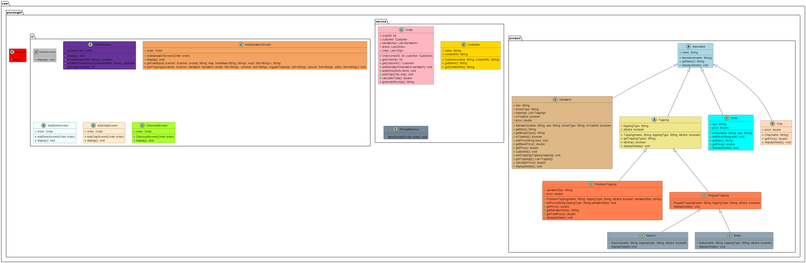

# Byyte Now

## Description of the Project

Byyte Now is a Java POS application designed to streamline the process of ordering sandwiches, drinks, and chips. The application allows users to customize their sandwiches with various toppings, choose their preferred drinks, and add chips to their order. It aims to enhance the ordering experience by providing an easy-to-use interface for creating and managing orders. The intended users are sandwich shop customers who want a quick and efficient way to place their orders.

<figure>
  
  <figcaption><i>Class Diagram</i></figcaption>
</figure>

## User Stories

- As a user, I want to input my order details so that the application can process my sandwich, drink, and chip selections.
- As a user, I want to receive immediate feedback about my order, so I can understand what to do next and confirm my choices.
- As a user, I want to customize my sandwich with different toppings, sizes, and bread types to suit my preferences.
- As a user, I want to review my order and receive a detailed receipt, so I can verify my purchase and keep a record.

## Setup

### Prerequisites

- IntelliJ IDEA: Ensure you have IntelliJ IDEA installed. You can download it from [here](https://www.jetbrains.com/idea/download/).
- Java SDK: Make sure Java SDK is installed and configured in IntelliJ.

### Running the Application in IntelliJ

Follow these steps to get your application running within IntelliJ IDEA:

1. Open IntelliJ IDEA.
2. Select "Open" and navigate to the directory where you cloned or downloaded the project.
3. After the project opens, wait for IntelliJ to index the files and set up the project.
4. Find the main class `Program.java` located in the `com.pluralsight` package.
5. Right-click on the file and select 'Run 'Program.main()'' to start the application.

## DEMO

<figure>
  
  <figcaption><i>Receipt screenshot</i></figcaption>
</figure>

## Technologies Used

- Java 22.
- Intellij IDEA

## Future Work

Potential future enhancements or functionalities:

- Implementing a graphical user interface (GUI) for a more intuitive user experience.
- Adding more customization options for sandwiches, drinks, and chips.
- Integrating payment processing to handle transactions directly within the application.
- Expanding the application to support different types of orders beyond sandwiches.

## Resources

- <a href="https://www.w3schools.com/java/" hreflang="en" target="_blank"> w3schools</a>
- <a href="https://www.amazon.com/Think-Java-Like-Computer-Scientist/dp/1492072508/ref=sr_1_1?crid=1XNHDEIULUJZ2&dib=eyJ2IjoiMSJ9.d0t0lx-6QJg-JsjxgIYcxMppCLgV11zcjSPrvRheLJcf1JZHTqUbSaQBIe7_ApyaFLlf8g9t8VSatCSplBQui7jl12-njNw3WFfsNv0rxERZpeRoHVasN3f-W1she4ZeGSu4GpW0UMr69WQoARTE2tbZ8UOHk2VJcC5XpeOL9k47Lr-Q9rEDiMF40-r-T-Gh0qaIcX1uMU3tY8sNjtmE7NijWBXqLD5GolLveWbWA08.lciBh_nLC7cX0HQKjArI7puLVg9STTtj3OMe6v_45eM&dib_tag=se&keywords=think+java&qid=1715817869&sprefix=think+java%2Caps%2C206&sr=8-1" hreflang="en" target="_blank">Think Java</a>

## Thanks

- Thank you to Raymond for continuous support and guidance.
- A special thanks to all teammates for their dedication and teamwork.
